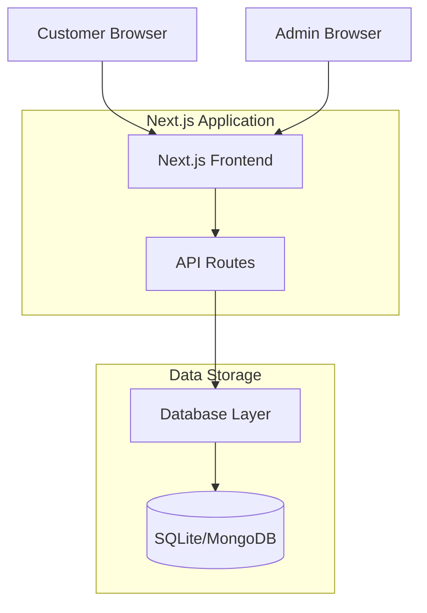

# Design Document

## Overview

SwiftShip is a Next.js-based package tracking system that provides a customer-facing interface for tracking packages and an administrative interface for managing package data. The system uses a modern web stack optimized for performance and ease of deployment on Vercel.

## Architecture

### High-Level Architecture



### Technology Stack

- **Frontend Framework**: Next.js 13+ with App Router
- **Styling**: CSS Modules with global styles
- **Database**: SQLite3 for all environments
- **Authentication**: Next-auth.js for admin panel protection
- **Deployment**: Vercel (optimized for Next.js)
- **API**: Next.js API routes for backend functionality

## Components and Interfaces

### Frontend Components

#### Core Pages
- **Homepage (`pages/index.tsx`)**: Landing page with tracking search
- **Tracking Page (`pages/track.tsx`)**: Package tracking results display
- **Contact Page (`pages/contact.tsx`)**: Customer contact form
- **Admin Panel (`pages/admin.tsx`)**: Protected administrative interface

#### Reusable Components
- **Header (`components/Header.tsx`)**: Navigation and branding
- **Footer (`components/Footer.tsx`)**: Site footer with links
- **PackageCard (`components/PackageCard.tsx`)**: Package information display component

### API Endpoints

#### Public APIs
- **GET/POST `/api/track`**: Package tracking lookup
  - Input: `{ trackingNumber: string }`
  - Output: `{ package: PackageData | null, error?: string }`

- **POST `/api/contact`**: Contact form submission
  - Input: `{ name: string, email: string, message: string }`
  - Output: `{ success: boolean, message: string }`

#### Admin APIs
- **POST `/api/admin/update`**: Package status updates (protected)
  - Input: `{ trackingNumber: string, status: string, location: string, notes?: string }`
  - Output: `{ success: boolean, message: string }`

- **GET `/api/admin/packages`**: List all packages (protected)
  - Output: `{ packages: PackageData[] }`

## Data Models

### Package Data Model

```typescript
interface PackageData {
  id: string;
  trackingNumber: string;
  status: PackageStatus;
  currentLocation: string;
  destination: string;
  estimatedDelivery?: Date;
  lastUpdated: Date;
  statusHistory: StatusUpdate[];
  customerInfo: {
    name?: string;
    email?: string;
  };
}

enum PackageStatus {
  CREATED = 'created',
  PICKED_UP = 'picked_up',
  IN_TRANSIT = 'in_transit',
  OUT_FOR_DELIVERY = 'out_for_delivery',
  DELIVERED = 'delivered',
  EXCEPTION = 'exception'
}

interface StatusUpdate {
  status: PackageStatus;
  location: string;
  timestamp: Date;
  notes?: string;
}
```

### Contact Form Model

```typescript
interface ContactSubmission {
  id: string;
  name: string;
  email: string;
  message: string;
  submittedAt: Date;
  resolved: boolean;
}
```

## Database Design

### SQLite3 Schema

```sql
-- Packages table
CREATE TABLE packages (
  id TEXT PRIMARY KEY,
  tracking_number TEXT UNIQUE NOT NULL,
  status TEXT NOT NULL,
  current_location TEXT NOT NULL,
  destination TEXT NOT NULL,
  estimated_delivery TEXT,
  last_updated TEXT NOT NULL,
  customer_name TEXT,
  customer_email TEXT
);

-- Status history table
CREATE TABLE status_updates (
  id TEXT PRIMARY KEY,
  package_id TEXT NOT NULL,
  status TEXT NOT NULL,
  location TEXT NOT NULL,
  timestamp TEXT NOT NULL,
  notes TEXT,
  FOREIGN KEY (package_id) REFERENCES packages (id)
);

-- Contact submissions table
CREATE TABLE contact_submissions (
  id TEXT PRIMARY KEY,
  name TEXT NOT NULL,
  email TEXT NOT NULL,
  message TEXT NOT NULL,
  submitted_at TEXT NOT NULL,
  resolved BOOLEAN DEFAULT FALSE
);
```

### SQLite3 Indexes and Optimization

```sql
-- Create indexes for performance
CREATE INDEX idx_packages_tracking_number ON packages(tracking_number);
CREATE INDEX idx_status_updates_package_id ON status_updates(package_id);
CREATE INDEX idx_status_updates_timestamp ON status_updates(timestamp);
CREATE INDEX idx_contact_submissions_submitted_at ON contact_submissions(submitted_at);
```

## Error Handling

### Client-Side Error Handling
- Form validation with real-time feedback
- Network error handling with retry mechanisms
- User-friendly error messages for all failure scenarios
- Loading states during API calls

### Server-Side Error Handling
- Input validation for all API endpoints
- Database connection error handling
- Graceful degradation for service unavailability
- Structured error responses with appropriate HTTP status codes

### Error Response Format
```typescript
interface ErrorResponse {
  success: false;
  error: {
    code: string;
    message: string;
    details?: any;
  };
}
```

## Security Considerations

### Authentication
- Admin panel protected with Next-auth.js
- Session-based authentication for admin users
- Secure password handling and storage

### Data Protection
- Input sanitization for all user inputs
- SQL injection prevention through parameterized queries
- XSS protection through proper data encoding
- Rate limiting on API endpoints

### Environment Security
- Environment variables for sensitive configuration
- Database credentials stored securely
- HTTPS enforcement in production

## Performance Optimization

### Frontend Performance
- Next.js automatic code splitting
- Image optimization with Next.js Image component
- CSS optimization and minification
- Client-side caching for tracking results

### Backend Performance
- Database indexing on tracking numbers
- Connection pooling for database access
- API response caching where appropriate
- Optimized database queries

## Testing Strategy

### Unit Testing
- Component testing with React Testing Library
- API route testing with Jest
- Database operation testing
- Utility function testing

### Integration Testing
- End-to-end user flows with Playwright
- API integration testing
- Database integration testing
- Authentication flow testing

### Testing Structure
```
tests/
├── components/
├── pages/
├── api/
├── lib/
└── e2e/
```

## Deployment Strategy

### Vercel Deployment
- Automatic deployments from Git repository
- Environment variable configuration
- Database connection setup
- Domain configuration and SSL

### Environment Configuration
- Development: Local SQLite3 database file
- Staging: SQLite3 database with regular backups
- Production: SQLite3 with automated backup and replication

## Monitoring and Maintenance

### Logging
- API request/response logging
- Error tracking and reporting
- Performance monitoring
- User activity tracking

### Maintenance Tasks
- Database backup procedures
- Performance monitoring and optimization
- Security updates and patches
- Feature usage analytics